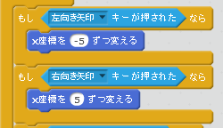

# 課題作成手順

## 目標とするプログラム
これと同じものを、以下の手順で作っていきます。

https://scratch.mit.edu/projects/68155398/

## 作成手順

### プレイヤーキャラクターの作成

1. "プレイヤー"スプライトに好きなキャラクタを設定。

1. 自分キャラクターの移動処理を作成。

カーソルの左右キーで、プレイヤーを移動。

1. 自分キャラクターの攻撃用スプライトと攻撃処理を作成。
	* 弾の座標を自分のキャラクターの座標に合わせるには、「○○へ行く」を使う。
	* 弾のスプライトは、描いた後中央設定をきちんとしておくこと。でないと発射位置がずれる。

1. 自分のキャラクターを複製して、敵キャラの元を作成。
1. 自分キャラクターの攻撃用スプライトを複製して、敵の攻撃用スプライトを作る。
1. 敵キャラの移動処理を変更。
1. キャラの攻撃処理を変更。
