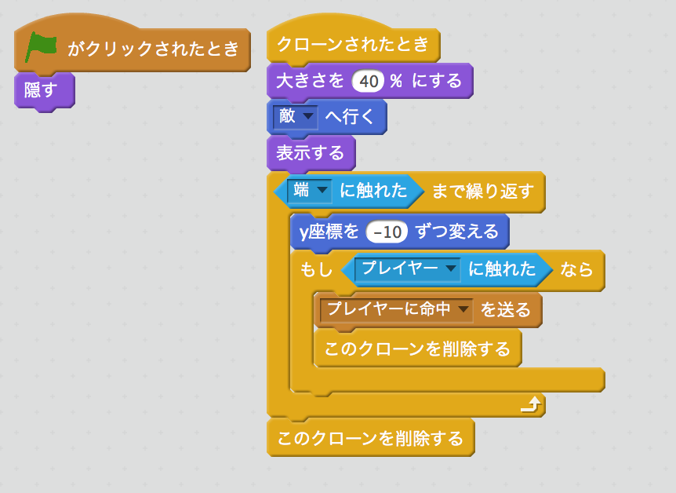

# 課題作成手順

## 目標とするプログラム
これと同じものを、以下の手順で作っていきます。

https://scratch.mit.edu/projects/68155398/

## 作成手順

### プレイヤーキャラクターの表示と移動

1. "プレイヤー"スプライトにキャラクタを設定  
デフォルトのスプライトをプレイヤーが操作するキャラクターとして、"プレイヤー"と名前をつけ好きな画像を設定します。

1. 最初の表示処理  
スタート時の表示処理を以下の通り作成。これらは無くても動作上問題ないけれど、プログラムを作っている途中でスプライトの状態が変わってしまっても必ず決まった状態でスタートさせることができる。大きさの指定は使うす画像の大きさに合わせて変更する。  

1. 自分キャラクターの移動処理  
カーソル左右キーを押した時の処理を以下の通り作成。

「◯◯キーが押された、ではない、まで繰り返す」としているのは、一度キーが押されたら離されるまでずっと移動し続けるためです。
以下のような処理でも操作はできるようになりますが、キーが離されるまで移動し続ける処理にした方がスムーズに動きます。

### 敵キャラクターの表示と移動

1. 新しいスプライトを敵にキャラクタを設定。  
新しいスプライトを作成し、"敵"と名前をつけます。

1. 初期表示処理  
プレイヤーの時と同様に、初期表示処理を作成します。

1. 敵キャラの移動処理
敵キャラは、画面の上半分を自由に移動するように以下の処理を作成します。ここで使っているのは、指定した時間で指定した場所へキャラクタを移動させる部品です。時間を長くするとゆっくり、短くすると速く動きます。ここでは、画面の横方向を端から端まで表示させるために-180から180までを乱数で、縦方向は上半分までを移動させるために0から180までの乱数を使って、ランダムに動くようにしています。

### プレイヤーの攻撃

1. 攻撃用スプライトの作成  
まず、プレイヤーが発射する弾のスプライトを新しいスプライトとして作成し、「プレイヤーの攻撃」と名前をつけます。ライブラリから好きな素材を選んでもいいですし、自分で描いてもいいです。自分で描く場合は「ベクターモード」で描きましょう。「ベクターモード」の方が、綺麗なまま画像を拡大縮小できます。  
また、「コスチュームの中心」を合わせておきましょう。これをやっておかないと、キャラクタと発射する弾の表示がズレることがあります。「コスチュームの中心」は、「コスチューム」画面の右上にある十字のボタンで合わせられます。

1. 初期表示処理
攻撃用スプライトは、ゲーム開始時には非表示で、攻撃動作を行った時に表示されなければなりませんので、ゲーム開始時には非表示とします。

1. 攻撃操作処理
プレイヤー側は、「スペースキー」を攻撃用操作とします。「プレイヤー」スプライトの中（「プレイヤーの攻撃」ではありません）に「スペースキー」が押された時に先ほど作った「攻撃用スプライト」をクローンする処理を作ります。クローンとはスプライトのコピーを作る機能で、同じキャラクタを複数作ったり、弾をたくさん発射するといったことができます。最後に「0.5秒待つ」を入れているのは、連射になるのを防ぐためです。これを外してスペースキーを押しっぱなしにすると、画面上が弾だらけになるほど連射ができます。

1. 弾丸スプライト表示処理  
プレイヤーの操作が行われた時に、弾丸スプラインを移動する処理を以下の通り作成します。  
処理の開始は、「クローンされた時」になります。このスプライトは最初「非表示」になっているので、プレイヤーのスプライトなどと同じように大きさの設定をし、「プレイヤーへ行く」を実行した後、「表示」を実行します。「プレイヤーへ行く」を実行しているのは、弾丸はプレイヤーと同じ場所から移動を開始しないといけないので、この処理でプレイヤーと同じ場所から表示されるようにするためです。
  

1. 弾丸スプライト移動と当たり判定処理  
次にこの弾丸を移動する処理を続けて作成します。弾丸は、画面の端に到達するか敵に当たると消えなければならないので、どちらかの条件で「クローンを削除する」を実行します。クローンを削除するとこの弾丸の動作を終了して画面から消えます。  
ただし、何もせずに消えてしまっては当たったかどうかわからないので、「敵に触れた」時に特別な処理ができるよう「クローンを削除」する前に「敵にあたった」というメッセージを送って、敵キャラに処理を実行させるようにします。  
  

1. 敵への命中処理
敵に弾丸が当たった時あたったことがわかるよう、「敵」スプライトに色を変える処理を追加します。ここでは、色の効果を変える処理を10回繰り返して、点滅のような表示をし最後に元の色に戻しています。  
  

### 敵キャラの攻撃

1. 攻撃用スプライトの作成  
敵キャラの攻撃用スプライトは、プレイヤーの弾丸を複製して作ります。画面左下のスプライトの一覧から「プレイヤーの弾丸」を右クリックして複製します。プログラムそのものはプレイヤーも敵も同じですが、当たり判定の対象などが違いますので、以下の部分を変更します。
	- 「プレイヤーへ行く」→「敵へ行く」
	- Y座標の変化量をマイナスの数値に。
	- 「もし敵に触れた」→「もしプレイヤーに触れた」
	- 「敵に命中」→「プレイヤーに命中」

