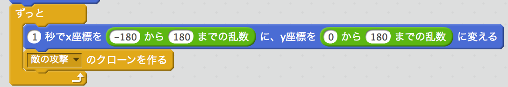

# FirstMission作成手順

## 目標とするプログラム
これと同じものを、以下の手順で作っていきます。

FirstMission
https://scratch.mit.edu/projects/68155398/

## 作成するもの
次の４つのスプライトを作っていきます。

|スプライト名|内容|
|---|---|
|プレイヤー|プレイヤーが操作するキャラクターです。|
|敵|プレイヤーと戦うキャラクタです。移動と攻撃をプログラムで行います。|
|プレイヤーの攻撃|プレイヤーが発射する弾丸のスプライトです。|
|敵の攻撃|敵が発射する弾丸のスプライトです。|

## 作成手順
### プレイヤーキャラクターの表示と移動

1. プロジェクトの作成  
Scratchの画面で「作る」を選んで作成画面を表示します。

1. 「プレイヤー」スプライトにキャラクタを設定  
最初に表示される猫のスプライトをプレイヤーが操作するキャラクターとします。分かりやすいように名前を「プレイヤー」にして、好きな画像を設定します。

1. 初期表示  
スタート時の表示処理を以下の通り作成。これらは無くても動作上問題ないですが、プログラムを作っている途中でスプライトの状態が変わってしまっても必ず決まった状態でスタートさせることができます。大きさの指定は使う画像の大きさに合わせて「○%」の数字を調整してください。  

1. 「プレイヤー」の移動  
「プレイヤー」は、カーソル左右キーを押した時に移動するよう処理を作成します。「◯◯キーが押された、ではない、まで繰り返す」としているのは、一度キーが押されたら離されるまでずっと移動し続けるためです。  
  
以下のような処理でも操作はできるようになりますが、キーが離されるまで移動し続ける処理にした方がスムーズに動きます。  

### 「敵」の表示と移動

1. 「敵」スプライトの作成  
好きな画像を選んで新しいスプライトを作成し、「敵」と名前をつけます。

1. 初期表示  
「プレイヤー」と同じように、初期表示処理を作成します。  

1. 「敵」の移動処理
「敵」は、画面の上半分を自由に移動するように以下の処理を作成します。「敵」移動には、指定した時間で指定した場所へキャラクタを移動させる部品を使っています。時間を長くするとゆっくり、短くすると速く動きます。
ここでは、画面の横方向を端から端まで表示させるために-180から180までを乱数で、縦方向は上半分までを移動させるために0から180までの乱数を使って、ランダムに動くようにしています。  

### プレイヤーの攻撃

1. 攻撃用スプライトの作成  
「プレイヤー」が発射する弾のスプライトを作成し、「プレイヤーの攻撃」と名前をつけます。ライブラリから好きな素材を選んでもいいですし、自分で描いてもいいです。
	- 自分で描く場合は「ベクターモード」で描きましょう。「ベクターモード」の方が、綺麗なまま画像を拡大縮小できます。
	- 「コスチュームの中心」を合わせておきましょう。これをやっておかないと、キャラクタと発射する弾の表示がズレることがあります。「コスチュームの中心」は、「コスチューム」画面の右上にある十字のボタンで合わせられます。

1. 初期表示
「プレイヤーの攻撃」は攻撃動作を行った時だけ表示されなければならないので、ゲーム開始時には非表示とします。  

1. 攻撃操作
「プレイヤー」は、「スペースキー」を攻撃用操作とします。「プレイヤー」の中（「プレイヤーの攻撃」ではありません）に「スペースキー」が押された時に「プレイヤーの攻撃」をクローンする処理を追加します。
クローンとはスプライトのコピーを作る機能で、同じキャラクタを複数作ったり、弾をたくさん発射するといったことができます。
最後に「0.5秒待つ」を入れているのは、一回のキー操作で連射になるのを防ぐためです。これをはずして「スペースキー」を押しっぱなしにすると、画面上が弾丸だらけになるほど連射ができます。  

1. 「プレイヤーの攻撃」表示  
発射操作が行われた時に、「プレイヤーの攻撃」を表示します。  
処理の開始は「クローンされた時」になります。「プレイヤーの攻撃」は最初「非表示」になっているので、「プレイヤー」などと同じように大きさを設定し、「プレイヤーへ行く」を実行した後に「表示」を実行します。
「プレイヤーへ行く」を実行しているのは、「プレイヤーの攻撃」が「プレイヤー」と同じ場所から表示されるようにするためです。  
  

1. 「プレイヤーの攻撃」移動と当たり判定  
次に「プレイヤーの攻撃」を移動処理を追加します。  
「プレイヤーの攻撃」は、画面の端に到達するか「敵」に当たると消えなければならないので、どちらかの条件で「クローンを削除する」を実行します。
「クローンを削除する」で「プレイヤーの攻撃」は動作を終了して画面から消えます。  
ただし、何もせずに消えてしまっては当たったかどうかわからないので、「敵に触れた」時に特別な処理ができるよう「クローンを削除」する前に「敵に当たった」というメッセージを送っています。  
  

1. 「敵」への命中
「敵に当たった」というメッセージを、「敵」に受け取らせて色を変える処理を追加します。ここでは、「色の効果を変える」処理を10回繰り返して点滅のような表示をし、最後に元の色に戻しています。  
  

### 「敵」の攻撃

1. 攻撃用スプライトの作成  
「敵」の攻撃用スプライトは、「プレイヤーの攻撃」を複製して作ります。
画面左下のスプライトの一覧から「プレイヤーの攻撃」を右クリックして複製します。プログラムそのものは「プレイヤーの攻撃」も「敵の攻撃」も同じですが、当たり判定の対象などが違いますので、以下の部分を変更します。

|変更内容|変更前|変更後|
|---|---|---|
|弾丸の初期表示|「プレイヤーへ行く」|「敵へ行く」｜
|弾丸の移動|「y座標を10ずつ変える」|「y座標を-10ずつ変える」｜
|当たり判定|「もし敵に触れた」|「もしプレイヤーに触れた」｜
|命中時処理|「敵に命中」|「プレイヤーに命中」｜

  
1. 「敵の攻撃」の発射処理  
「敵」は、移動ごとに「敵の攻撃」を発射するようにします。つまり、移動を実行した後に「クローンを作る」を実行します。  

以上で、このプログラムは完成です！

## アレンジ
ここまでに作ったプログラムをアレンジてみましょう。

### 簡単なアレンジ
- 「プレイヤー」の「スペースキー」が押された時に待つ時間を変えて攻撃のしやすさを変えてみる。
- 「敵」が移動する時の時間を変えて、攻撃のしやすさを変えてみる。
- 攻撃が当たった時の変化を色だけじゃなくて、

### ちょっと難しいアレンジ
- 変数を使ってスコアを作り、「プレイヤーの攻撃」が敵に当たったら点数が加算されるようにする。
- 変数を使って「敵の攻撃」が「プレイヤー」に当たった回数を数えて、「敵の攻撃」が３回あたったらゲームオーバーにする。
- 「プレイヤー」や「敵」のスプライトに攻撃が当たった時の画像を追加して、当たると画像が切り替わるようにする。

***
2015年6月24日作成

